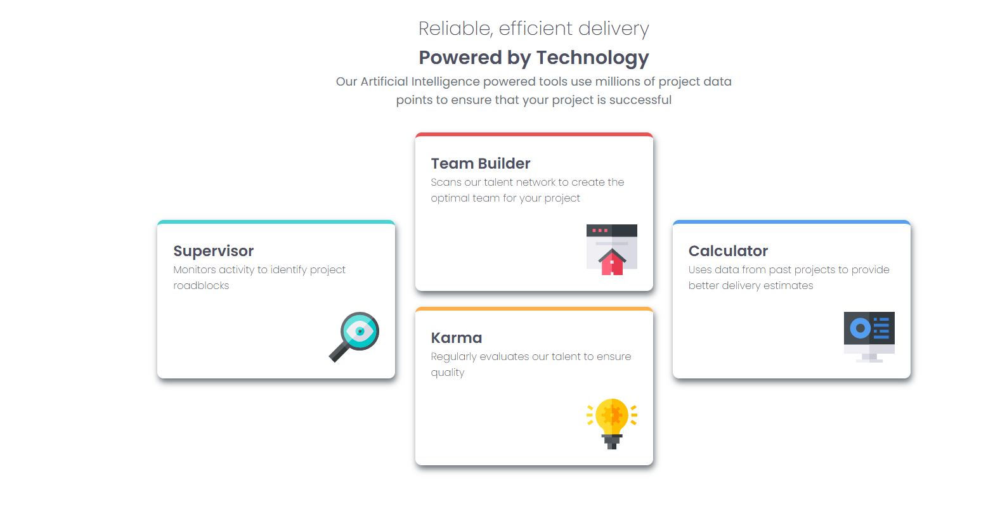

# Frontend Mentor - Four card feature section solution

This is a solution to the [Four card feature section challenge on Frontend Mentor](https://www.frontendmentor.io/challenges/four-card-feature-section-weK1eFYK). Frontend Mentor challenges help you improve your coding skills by building realistic projects. 

## Table of contents

  - [The challenge](#the-challenge)
  - [Screenshot](#screenshot)
  - [Links](#links)
  - [Built with](#built-with)
  - [What I learned](#what-i-learned)
  - [Continued development](#continued-development)
- [Author](#author)
- [Acknowledgments](#acknowledgments)

### The challenge

Users should be able to:

- View the optimal layout for the site depending on their device's screen size

### Screenshot

### Links

- Solution URL: [Add solution URL here](https://github.com/Jascran23/FM-four-card-flex)
- Live Site URL: [Add live site URL here](https://jascran23.github.io/FM-four-card-flex/)

 
### Built with

- Semantic HTML5 markup
- CSS custom properties
- Flexbox
- Mobile-first workflow

### What I learned

With the practical studies, I learned how to use the flex display, which helped me a lot in interactivity with the responsive layout.

### Continued development

I intend to develop myself in the front-end area, develop projects that challenge me and make me evolve in the programming area.

## Author

- Frontend Mentor - [@Jascran23](https://www.frontendmentor.io/profile/Jascran23)

## Acknowledgments

I am grateful for the challenge and for this platform that helps and encourages those who are starting out in the programming field.
